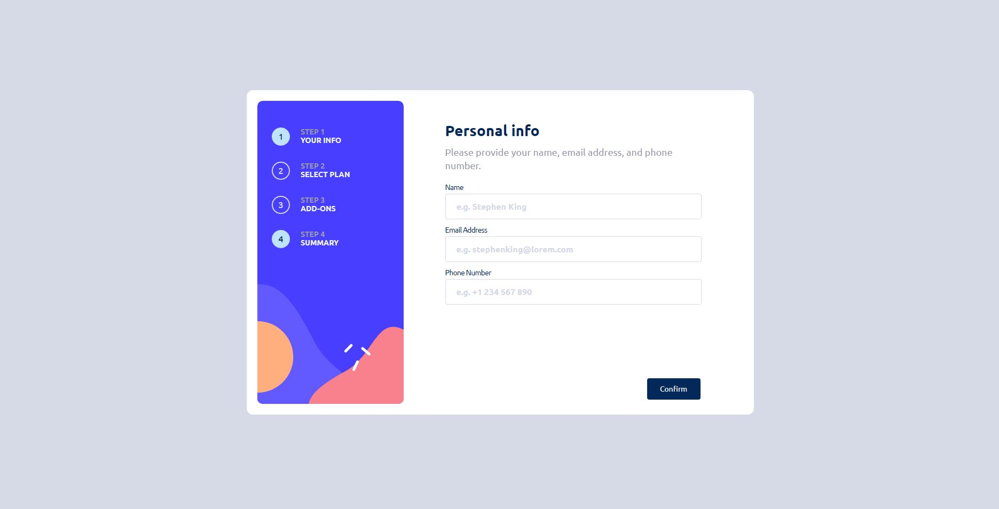

# MULTI STEP FORM

## Tabla de contenidos

- [Descripcion](#descripcion)
  - [El desafio](#el-desafio)
  - [Screenshot](#screenshot)
  - [Links](#links)
- [Mi proceso](#mi-proceso)
  - [Hecho con](#hecho-con)
  - [Lo aprendido](#lo-que-aprendi)
  - [En desarrollo](#en-desarrollo)
- [Autor](#autor)

## Descripcion

Solucion al reto de crear un componente interactivo de formulario con varios pasos. Contiene formularios de llenado de informacion de usuario, seleccion de plan, seleccion de complementos y un apartado final de resumen. Realizado con React y Vite.

## El desafio

El usuario deberia poder

- Completar cada paso de la secuencia
- Volver a un paso anterior y actualizar su seleccion
- Ver la informacion en la pantalla final de sus selecciones y confirmar
- Recibir mensajes de validacion de formulario si:
  - Falta un campo por llenar
  - La direccion de email no esta en el formato adecuado
  - No hizo ninguna seleccion
- Ver el layout optimo dependiendo de su tamano de pantalla.
- Ver la interaccion cuando se coloca el mouse encima de los elementos.

## Screenshot

## Links

- Solucion: [GITHUB](https://github.com/J-HernandezM/multistep-form)
- Live site: [PAGES](https://j-hernandezm.github.io/multistep-form/)

## Mi proceso

Esta es mi primera aplicacion realizada con React por mi cuenta, sin ayudas, ni cursos guia. En general me siento muy bien de haberlo logrado, con los conocimientos que tengo hasta el momento de React pienso que logre resolver todos los problemas que se fueron presentando de una manera adecuada.

Al usar React pude resolver ciertos problemas con mucha mayor facilidad que usando JS vanilla, sin embargo hay ciertas cosas que se me complicaron un poco por estar usando esta estructura de componentes y aun no saber cual es la mejor manera para ello.

Ademas tambien es mi primer proyecto utilizando VITE y siento que su sencillez me permitio implementar mi codigo con facilidad.

## Hecho con

- Semantic HTML5 markup
- CSS custom properties
- Flexbox
- CSS Grid
- Mobile-first workflow
- Simple JavaScript
- React
- Vite

## Lo que aprendi

Reforce mis conocimientos de React, el uso de Hooks, efectos, estados, etcetera. Ademas pude emplear Vite y usar su sistema de archivos y configuracion. 

## En desarrollo

Creo que de todas las cosas que se le pueden agregar a este aplicativo, serian por fuera del mismo, es decir paginas que le complementen porque este en si mismo creo que quedo 100% perfecto, tal vez las validaciones del campo input deberian mejorar o en un futuro conectar la informacion seleccionada con un backend usando node.

## Autor

- Website - [Portfolio en construccion](https://j-hernandezm.github.io)
- Github - [@J-HernandezM](https://github.com/J-HernandezM)
- Twitter - [@__HernandezM](https://www.twitter.com/__HernandezM)